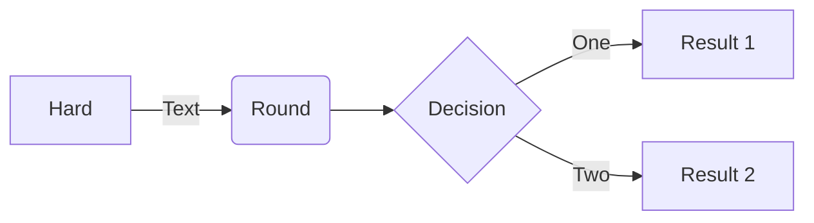

# Markdown
:smiley:

## Alerts

> [!NOTE]
> Useful information that users should know, even when skimming content.
> Useful information that users should know, even when skimming content.
> Useful information that users should know, even when skimming content.
> Useful information that users should know, even when skimming content.

> [!TIP]
> Helpful advice for doing things better or more easily.

> [!IMPORTANT]
> Key information users need to know to achieve their goal.

> [!WARNING]
> Urgent info that needs immediate user attention to avoid problems.

> [!CAUTION]
> Advises about risks or negative outcomes of certain actions.

## About me
---
> If we pull together and commit ourselves, then we can push through anything.

— Mona the Octocat

Hi, I'm Mona. You might recognize me as GitHub's mascot.

| Rank | Languages |
|-----:|-----------|
|     1| JavaScript|
|     2| Python    |
|     3| SQL       |

<details>
<summary>My top THINGS-TO-RANK</summary>

YOUR TABLE

</details>

## hljs
```js
function Page({ children }: { children: string }) {
    return (
        <Markdown
            className="container-lg px-3 my-5 markdown-body"
            rehypePlugins={[
                remarkGfm,
                rehypeHighlight,
            ]}
        >{children}</Markdown>
    )
}
```


## mermaid


