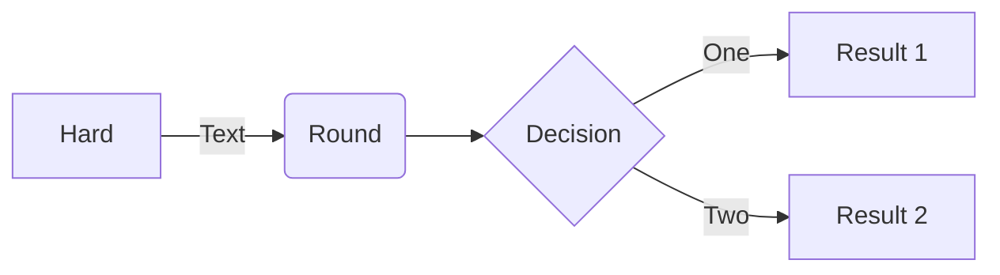

# Page not found
:smiley:

## hljs
```js
function Page({ children }: { children: string }) {
    return (
        <Markdown
            className="container-lg px-3 my-5 markdown-body"
            rehypePlugins={[
                remarkGfm,
                rehypeHighlight,
            ]}
        >{children}</Markdown>
    )
}
```

## mermaid


